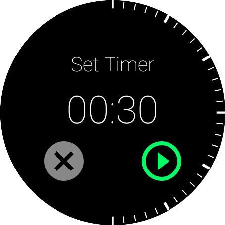
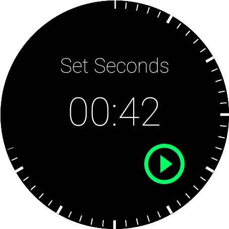
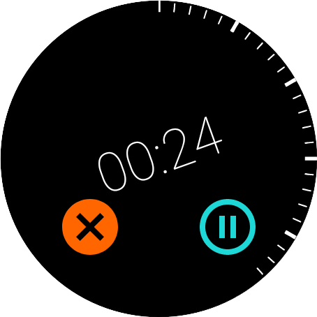
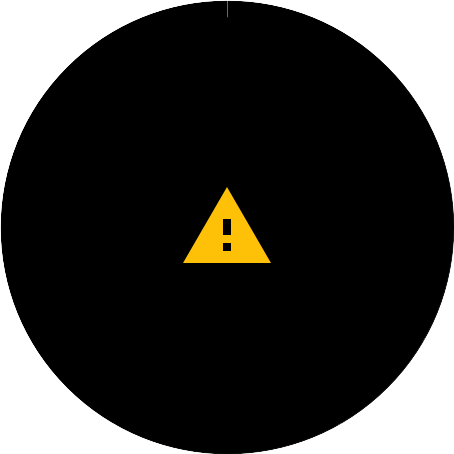

# bezel-timer
A better Android Wear OS timer app designed to make use of the Galaxy Watch rotating bezel

Bezel-timer has been designed to be as fast and easy to use as possible, unlike other timer apps
there are not multiple views between you and starting a timer, just open the app and rotate the 
bezel. Simple.

This is achieved by making assumptions about the precision required in a timer over different
periods. 

- Under 1 minute the timer can be set in increments of 5 seconds.
- Between 1 and 5 minutes it can be set in increments of 30 seconds.
- Between 5 minutes and up to 1 hour can be set in increments of 1 minute.
- Beyond 1 hour increments of 5 minutes are used.
- More control over the required timer length can be attained by pressing the corresponding area of displayed countdown timer. This enables precise entering of hours, minutes and seconds individually if required.

## Screenshots
### Setting the time

### During the countdown
Controls disappear and time countdown sways to avoid burn in.

### Alarm
An alarm is sounded when the timer is up, this doesn't need to be dismissed.

